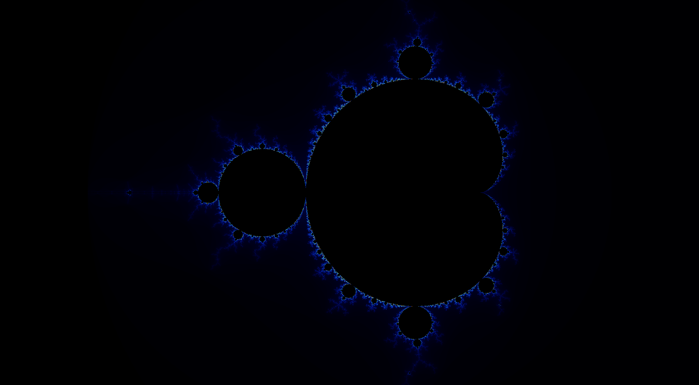

# Mandelbrot & Julia Set Generator

A high-performance fractal generator that implements both Mandelbrot and Julia sets with multiple computation backends: serial CPU, parallel CPU (OpenMP). Features an interactive GUI for real-time exploration and zoom capabilities.

## Features

- **Serial Implementation**: Basic single-threaded Mandelbrot generation
- **Parallel CPU**: OpenMP-accelerated multi-threaded computation
- **Julia Set Support**: Dynamic Julia set generation with mouse-controlled parameters
- **Image Export**: Save high-resolution fractals as PNG files
- **Performance Benchmarking**: Compare execution times across all implementations

## Project Structure

```
Mandelbrot/
├── src/
│   ├── main.c          # CLI interface
│   ├── main.cpp        # GUI application (SFML)
│   └── fractal.c       # Core fractal algorithms
├── lib/
│   ├── fractal.h       # Function declarations
│   └── stb_image_write.h # PNG export library
├── bin/            # Compiled executables
├── image/          # Generated fractal images
└── makefile        # Build configuration
```

## Dependencies

- **C/C++ Compiler**: GCC with OpenMP support
- **OpenCL**: GPU computation framework
- **SFML**: GUI framework (Simple and Fast Multimedia Library)
- **STB Image Write**: PNG export functionality (included)

### Installation (Ubuntu/Debian)
```bash
sudo apt update
sudo apt install gcc g++ libsfml-dev opencl-headers ocl-icd-opencl-dev
```

## Compilation & Usage

### Build Commands

```bash
# Build directory structure
make build

# Compile and run CLI version
make cli

# Compile and run GUI version  
make gui
```

### Manual Compilation

```bash
# CLI version
gcc -Wall -Wextra -fopenmp -O2 -I./lib -lOpenCL src/main.c src/fractal.c -o bin/main_cli -lm

# GUI version
g++ -lsfml-graphics -lsfml-window -lsfml-system -fopenmp -lOpenCL -I./lib src/main.cpp src/fractal.c -o bin/main_gui -lm
```

## Usage

### Command Line Interface
```bash
./bin/main_cli
# Follow prompts to set width, height, and output filename
```

### GUI Application
```bash
./bin/main_gui
```

**GUI Controls:**
- **Width/Height Fields**: Set image resolution
- **Generate CPU**: Run serial + parallel CPU comparison
- **Save**: Export current fractal as PNG
- **Mode Toggle**: Switch between Mandelbrot and Julia sets
- **Mouse**: In Julia mode, mouse position controls the complex constant `c`

## Implementation Details

### 1. Serial Implementation
Located in [`src/fractal.c`](src/fractal.c) - [`generate_serial`](src/fractal.c)

Basic iterative approach computing each pixel sequentially:
```c
for (int y = 0; y < height; y++) {
    for (int x = 0; x < width; x++) {
        // Mandelbrot iteration for pixel (x,y)
    }
}
```

### 2. Parallel CPU Implementation  
Located in [`src/fractal.c`](src/fractal.c) - [`generate_parallel`](src/fractal.c)

OpenMP parallelization with dynamic scheduling:
```c
#pragma omp parallel for schedule(dynamic)
for (int y = 0; y < height; y++) {
    // Parallel row processing
}
```

### 3. Julia Set Implementation
Functions: [`generate_julia_serial`](src/fractal.c), [`generate_julia_parallel`](src/fractal.c)

Uses fixed complex constant `c` instead of pixel coordinates:
```c
// Julia: z = z² + c (where c is constant)
// Mandelbrot: z = z² + (x + yi) (where c varies per pixel)
```

## Performance Benchmarking

### Test Configuration
- **Resolution**: 1920x1080 pixels
- **Max Iterations**: 1000

### Results
```
=== BENCHMARK RESULTS ===
Serial time:   2.429 seconds
Parallel time: 0.725 seconds
Speedup:       3.35x (parallel is 3.35x faster)
```

## Sample Output

### Mandelbrot Set


*Classic Mandelbrot set showing the characteristic bulbous shape and intricate boundary details*


## Technical Notes

### Color Mapping
Uses smooth color interpolation based on iteration count:
```c
double t = (double)iter / (double)max_iter;
int r = (int)(9*(1-t)*t*t*t*255);
int g = (int)(15*(1-t)*(1-t)*t*t*255);  
int b = (int)(8.5*(1-t)*(1-t)*(1-t)*t*255);
```

### Optimization Strategies
- **Dynamic Scheduling**: OpenMP load balancing for irregular workloads
- **Memory Coalescing**: GPU threads access contiguous memory
- **Early Termination**: Stop iteration when |z| > 2 (divergence condition)